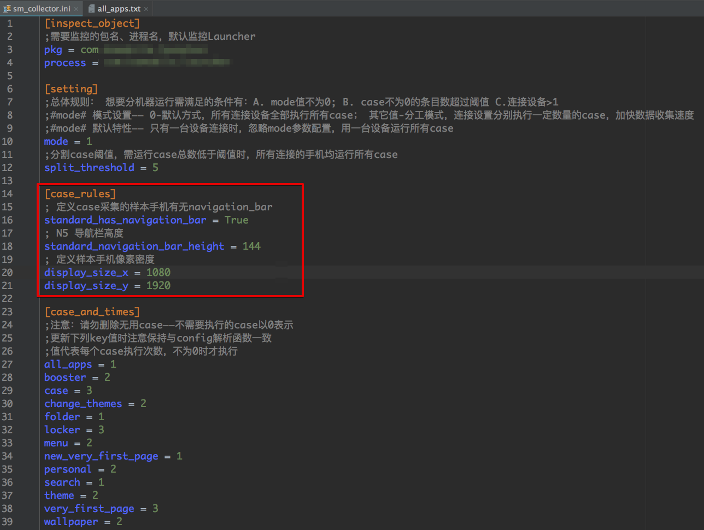

# SM流畅度自动收集工具使用方法
## 使用：

    0. 准备工作：
       1. 基于 `python 2.7`
       2. 首先clone 项目到本地目录（`local_path`）
       3. 测试手机需要授予Root权限 （原因：核心逻辑通过APK包中的命令行实现）
    1. 上手：
       1. 编写你的case文件(编写玩后放置到`local_path/case`文件夹中)
       2. 在`local_path/config/sm_collector.ini` 这一文件中配置你想运行的脚本以及运行次数
       3. 连接要测试的手机（支持多设备），在命令行中输入：`python SMCollector.py`
## 详细说明

### 关于case的说明

> 详细内容参见 `local_path/case/_ReadMe.md`

关于屏幕size的设定位于`local_path/config/sm_collector.ini`中，会自动适配手机尺寸，支持不同分辨率手机的测试（配置文件中设置的是采集case的标准手机的属性）

支持的动作有：

* 配置case屏幕信息：display_config, V_display_size_x, V_display_size_y, V_navigation_bar_height
* 滑动           ：swipe, V_fromX, V_fromY, V_toX, V_toY (, V_wait_several_seconds)
* 点击           ：click, V_x, V_y (, V_wait_several_seconds)
* 长按           ：hold, V_x, V_y (, V_wait_several_seconds)
* 桌面           ：home
* 返回           ：back
* 等待           ：wait, V_seconds
* 特殊模式        ：special_mode
* 开启想监控的app  ：start （需要在sm_collector.ini文件中配置启动的Activity）
* 停止想监控的app  ：stop
* 清除app的数据    : clear_data
* 清除手机logcat日志: clear_logcat
* 开启监控程序     ：invoke_watcher  （默认是用的SM收集程序 sm_collector.apk）
* 开始等待app启动  ：start_command
* 停止监控，保存数据：stop_command
* 卸载APP         : uninstall   （卸载包名在sm_collector.ini的inspect_object选项中的pkg_name控制）
* 安装APP         : install (, V_apk_file_name, V_wait)   （安装apk文件名在sm_collector.ini的inspect_object选项中的to_install_apk控制）
* 强制重装APP      : install_r (, V_apk_file_name, V_wait)   （安装apk文件名在sm_collector.ini的inspect_object选项中的to_install_apk控制）

### 在 `local_path/config/sm_collector.ini`中配置各项特性**

支持的配置选项有：

1. 要监控的APP
2. 运行模式（分工进行/全全工进行）
3. case采集标准手机的具体信息（无需繁琐地采集各分辨率case）
4. 自定义添加case及各case运行次数
5. case支持的动作：点击、滑动、长按、home、back、wait
6. 对测试启动app这一特殊case的支持

#### 其它说明：

* **case只需用标准手机采集一次，即可自动适配所有分辨率手机（对标准采集手机不做限制[任意分辨率、也不限制是否有导航栏]，在ini中配备）**

* 可以多设备分配任务进行（用ini文件中的setting选项控制，详细操作办法见ini中注释）

* 收集的输出文件默认拉取至./output目录下

  部分具体配置说明截图如下：

  
